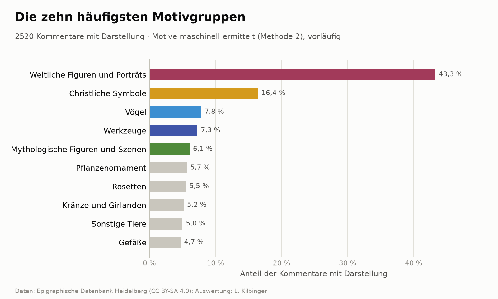
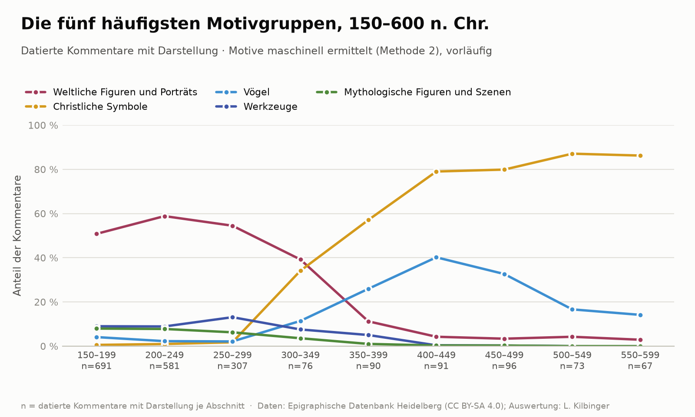

# edh-motif-extraction

**NLP-gestützte Erschließung von Metadaten in epigraphischen Datenbanken: Vokabular,
Goldstandard und Methodenvergleich geprüft am Datensatz der Epigraphischen Datenbank Heidelberg (EDH)**

Lisa Kilbinger, Philipps-Universität Marburg. Version 1.0, September 2026.
DOI: [DOI] · Daten: CC BY-SA 4.0 · Code: MIT · *[English version](README.md)*

Die Datenpublikation ist im Rahmen der HERMES-Forschungsstudie
[„NLP-gestützte Erschließung von Metadaten in epigraphischen Datenbanken“](https://www.hermes-hub.de/forschen/forschungsstudien/2026/IEG/nlp-gest%C3%BCtzte-erschlie%C3%9Fung-von-metadaten-in-epigraphischen-datenbanken.html)
(2026, Leibniz-Institut für Europäische Geschichte, IEG) entstanden.

## Überblick

Die vorliegende Datenpublikation ist ein Teilprojekt meiner Dissertation im
Bereich Digital Humanities an der Philipps-Universität Marburg. Ziel der
Dissertation ist die systematische Erfassung und Analyse figürlicher
Darstellungen auf spätantiken Grabinschriften. Diese Motive sind wichtige
Zeugnisse einer entstehenden christlichen Ikonographie, wurden jedoch bisher
nicht großflächig ausgewertet. Bestehende epigraphische Datenbanken erfassen
figürliche Darstellungen auf Inschriftenträgern bislang ausschließlich in unstrukturierter Form: als
Freitext im Kommentarbereich oder als editorische Anmerkung innerhalb der
Transkription. Diese Praxis verhindert eine systematische Auswertung und
maschinelle Verarbeitung der enthaltenen ikonographischen Informationen.
Die vorliegende Datenpublikation testet verschiedene Methoden, um diese
ikonographischen Informationen in strukturierte Daten zu überführen und beinhaltet

- ein mehrsprachiges **ikonographisches Vokabular** bestehend aus 374
  Bildelementen, in Kategorien sortiert, mit Suchbegriffen auf Deutsch,
  Latein und Englisch; 354 Motivregeln zur Zuordnung verschiedener Elemente
  zu einem ikonographischen Motiv (z. B. Dextrarum Iunctio, Schafträger);
  die Vokabeln sind mit Iconclass verknüpft und mit dem EAGLE-Vokabular
  (Europeana Network of Ancient Greek and Latin Epigraphy) abgeglichen

- einen **Goldstandard** aus 1100 zufällig gezogenen, von Hand annotierten
  EDH-Kommentaren (davon dienen 800 Kommentare als Entwicklungs- und 300 Kommentare als Testdaten), 
  Kommentare mit Konkordanz zu Trismegistos (1042 von 1100) und EDCS (947 von 1100)

- **Vier Methoden** zur automatischen Erkennung der Motive: Wörterbuchabgleich,
  Lemmatisierung (Stanza), Satzanalyse (Dependency Parsing) und ein feinabgestimmtes BERT-Modell,
  jeweils mit vollständigem Code zur Reproduktion aller berichteten Werte

- einen **Methodenvergleich** auf den 300 Testkommentaren, bewertet auf drei
  Ebenen (Darstellung vorhanden, Bildelemente, Motive), mit Bootstrap-Bereichen,
  Auswertung und Diskussion der Stärken und Grenzen der Methoden.

## Standards und Nachnutzung

Ziel ist, ikonographische Angaben, die bisher nur als Freitext vorliegen,
als strukturierte Metadaten nachnutzbar zu machen, und zwar nach den
FAIR-Prinzipien:

- **Normdaten und Fachvokabulare:** Verknüpfung der Bildelemente (wo Entsprechung vorhanden) 
  mit Iconclass (297 von 374) und dem [EAGLE-Vokabular „Decoration“](https://www.eagle-network.eu/voc/decor.html),
  Verknüpfung der Inschriften über ihre EDH-Nummer mit Trismegistos (1042 von 1100) und EDCS (947 von 1100).
- **Datenqualität:** Goldstandard mit Annotationsrichtlinien, getrennte
  Entwicklungs- und Testdaten, Werte mit Unsicherheitsbereichen.
- **Zugang:** DOI je Version über Zenodo, offene Formate (JSON, CSV, UTF-8),
  Metadaten in `.zenodo.json` und `CITATION.cff`.
- **Nachnutzung:** Daten unter CC BY-SA 4.0 (kompatibel mit der EDH-Lizenz),
  Code unter MIT; der Workflow ist auf andere epigraphische und (kunst-)historische
  Datenbanken übertragbar.

## Aufbau des Repositoriums

```
data/
  corpus/
    edh_comments.json         EDH-Kommentartexte
  gazetteer/                  Vokabular
    rules/                       Motivregeln und Varianten
    filters/                     signal_words, stoplist, false_friends, compound_exceptions
    categories.json           Kategorienbaum
    element_synonyms.json     Synonyme, mehrsprachig (de, la, en)
    elements.json             Vokabelliste
  goldstandard/               von Hand annotierte Kommentare, Richtlinien, Konkordanz
  method_comparison/           veröffentlichte Messung auf den Testdaten
    predictions/                 Ausgaben der Methoden: m1_dictionary.json … m4_bert_seed44.json
    bootstrap.json               Berechnung der statistischen Unsicherheit der Ergebnisse
    scores.csv, differences.csv  Ergebnistabellen
    m4_bert_runs.json            Prüfsummen und Trainingszeit der BERT-Läufe
src/
  paths.py                     alle Dateipfade und Dateinamen
  common/                      von allen Methoden geteilt (matching.py, motifs.py)
  methods/                     die vier Methoden
  evaluation/                  Messung und Auswertung
  analysis/                    erste Auswertung (Abbildungen)
figures/                       Abbildungen zur Veranschaulichung einer ersten Auswertung
results/                       Ergebnisse eigener Läufe (nicht versioniert, wird erzeugt)
  full_corpus/                   Methoden 1–3 über alle Kommentare
  method_comparison/             eigene Messung, aufgebaut wie data/method_comparison/
  bert/                          Silberstandard und Modelle von Methode 4
```

## Methoden und zugehörige Dateien

| | Methode | Vorgehen | Skript (`src/methods/`) |
|---|---|---|---|
| 1 | Wörterbuchabgleich | Suchbegriffe als Zeichenfolge im Text, ohne sprachliche Analyse; jedes Element ein eigenes Motiv | `m1_dictionary.py` |
| 2 | Lemmatisierung (Stanza) | Abgleich über die Grundform, Komposita; Motive je Satz | `m2_nlp_lemma.py` |
| 3 | Satzanalyse (Dependency Parsing, Stanza) | Erkennung wie 2; Motive je grammatisch verbundener Wortgruppe, mehrdeutige Wörter nach Kontext | `m3_dependency_chunked.py` (in Teilen, gleiches Ergebnis wie `m3_dependency.py`, weniger Speicher) |
| 4 | BERT (deepset/gbert-base) | feinabgestimmte Wortklassifikation, drei Trainingsläufe | `m4_bert.py` (`silver`, `train`, `predict`, `runs`) |

Alle Methoden nutzen dieselben Bausteine (`src/common/`), damit Unterschiede
allein auf Elementerkennung und Gruppierung zurückgehen:

- `matching.py`: Zeitfilter, Aufbereitung des Vokabulars, False Friends, Komposita, Mehrwortausdrücke, Zahlwörter, Signalwörter;
- `motifs.py`: Ableitung der Motive aus den gefundenen Elementen über
  `motif_rules.json` und Umwandlung von Formwörtern in Varianten.

Messung und Auswertung (`src/evaluation/`) sowie erste Auswertung
(`src/analysis/`):

| Skript | Funktion |
|---|---|
| `evaluation/measure_testsample.py` | wendet alle vier Methoden auf die 300 Testkommentare an → `predictions/` |
| `evaluation/evaluate.py` | Precision, Recall und F1 einer Methode gegen Entwicklungs- oder Testdaten |
| `evaluation/bootstrap.py` | 95-%-Bereiche der Werte und der Abstände zwischen den Methoden → `bootstrap.json` |
| `evaluation/comparison_tables.py` | Ergebnistabellen `scores.csv`, `differences.csv` aus `bootstrap.json` |
| `analysis/motif_groups.py` | Abbildungen in `figures/` |

`evaluate.py` und `comparison_tables.py` lesen wahlweise einen eigenen Lauf
(`results/method_comparison/`) oder mit `--published` die veröffentlichte
Messung (`data/method_comparison/`).


## Versuchsaufbau

### Datenaufteilung

Grundgesamtheit sind alle EDH-Inschriften mit Kommentar, die später als
150 n. Chr. datiert werden (Zeitfilter in `src/common/matching.py`). Die
1100 annotierten Kommentare wurden in drei Stichproben
aus derselben Zufallsfolge (fester Seed) gezogen und überschneiden sich
nicht (alle in `data/goldstandard/`):

| Datei | Kommentare | Rolle |
|---|---|---|
| `edh_devsample.json` | 500 | Entwicklungsdaten: an ihnen wurden Vokabular, Regeln und Methoden entwickelt |
| `edh_former_testsample.json` | 300 | ursprünglich als Testdaten gezogen; beim Annotieren zeigten sich Lücken im Vokabular, die ergänzt wurden. Da das Sample damit zur Entwicklung beigetragen hat, zählt es jetzt zu den Entwicklungsdaten und dient der Fehleranalyse |
| `edh_testsample.json` | 300, davon 70 mit Darstellung | die eigentlichen Testdaten: erst nach Abschluss der Methodenentwicklung gezogen und ausschließlich für die abschließende Messung verwendet |

Die Testdaten wurden nach denselben Richtlinien annotiert wie die
Entwicklungsdaten (`annotation_guidelines_de.md`), ohne Kenntnis der
Methodenergebnisse. 

### Einmalige Messung

Vokabular, Regeln, Code und die Einstellungen von Methode 4 wurden vor der
Annotation der Testdaten festgeschrieben. Jede Methode wurde einmal auf die
Testdaten angewandt (`measure_testsample.py`); nichts wurde anhand der
Testdaten ausgewählt oder angepasst.

### Bewertung

`evaluate.py` berechnet Precision, Recall und F1 auf drei Ebenen:

1. **Darstellung:** Enthält der Kommentar eine figürliche Darstellung (ja/nein)?
2. **Bildelemente:** Welche Bildelemente kommen im Kommentar vor? Gezählt
   wird jedes Element einmal je Kommentar, unabhängig von der Anzahl.
   Angegeben werden zwei Mittelwerte:
   - *Mikro-Mittel* über alle Vorkommen: häufige Elemente (z. B. Büste)
     bestimmen den Wert;
   - *Makro-Mittel* über die Elementtypen: jeder Typ zählt gleich, seltene
     Elemente fallen also stärker ins Gewicht.
3. **Motive:** Ein Motiv gilt nur als richtig, wenn Elementmenge und
   Kategorie genau mit dem Goldstandard übereinstimmen.

### Unsicherheit

Mit 300 Testkommentaren hängen alle Werte auch davon ab, welche Kommentare
zufällig in der Stichprobe gelandet sind. `bootstrap.py` schätzt diese
Unsicherheit: Aus den 300 Testkommentaren werden 10000-mal 300 Kommentare
mit Zurücklegen gezogen und alle Maße nach denselben Regeln wie in
`evaluate.py` neu berechnet. Der 95-%-Bereich reicht vom 2,5. bis zum
97,5. Perzentil (Efron/Tibshirani 1993). Der Zufall ist über einen festen
Startwert festgelegt; dieselben Methodenausgaben ergeben also immer
dieselben Bereiche.

Für den Vergleich zweier Methoden wird der Abstand ihrer Werte auf jeweils
derselben gezogenen Stichprobe berechnet (gepaarter Vergleich). Schließt der
Bereich des Abstands 0 aus, ist der Unterschied nicht allein durch die
Stichprobenauswahl zu erklären. Statt p-Werten werden diese Bereiche
berichtet, weil sie neben der Richtung auch die Größe des Unterschieds zeigen.

### Methode 4 (BERT)

Als lernende Methode erfordert Methode 4 zusätzliche Festlegungen
(`m4_bert.py`):

- **Aufgabe:** Wortklassifikation (Token Classification). Jedes Wort erhält
  kein, ein oder mehrere Element-Labels; jede im Training vorkommende
  Labelkombination ist eine eigene Klasse. Die Motive werden wie bei
  Methode 2 je Satz über `motifs.py` aus den Labels abgeleitet. Methode 4
  unterscheidet sich also nur in der Elementerkennung.
- **Trainingsdaten:**
  - die 500 Entwicklungskommentare, wortweise markiert
    (`edh_devsample_word_markings.json`, aus den Annotationen abgeleitet und
    von Hand geprüft);
  - ein **Silberstandard** (`m4_bert.py silver`): 2137 nicht annotierte
    Kommentare, in denen Methode 2 und 3 dieselben Elemente finden, nach
    derselben Logik markiert, dazu 500 Kommentare, die beide Methoden als
    „keine Darstellung“ einstufen. Der Silberstandard gleicht die geringe
    Menge an Handannotation aus. Er ist nicht von Hand geprüft und übernimmt
    daher die Lücken der Methoden 2 und 3. Alle drei annotierten Stichproben
    sind aus ihm ausgeschlossen.
- **Feste Einstellungen:** 2 Epochen, Lernrate 5·10⁻⁵, Stapelgröße 16, im
  von Devlin et al. (2019) empfohlenen Bereich. Die Einstellungen wurden
  nicht systematisch optimiert: Dafür wären eigene Validierungsdaten und
  mehrere Läufe je Einstellung nötig gewesen.
- **Drei Trainingsläufe:** Das Ergebnis hängt vom Zufall im Training ab
  (Anfangsgewichte, Reihenfolge der Beispiele). Methode 4 wurde daher dreimal
  mit identischen Daten und Einstellungen trainiert, die sich nur im Seed
  unterscheiden (Seed 42: `m4_bert.py train`; Seeds 43 und 44:
  `m4_bert.py runs`). Jeder Lauf wurde einmal gemessen. Berichtet werden
  Mittelwert ± Standardabweichung; in den Bootstrap geht das Mittel der drei
  Läufe ein. Prüfsummen der Modelle und des Silberstandards sowie die
  Trainingszeiten (für Seed 42 nicht erfasst) stehen in
  `data/method_comparison/m4_bert_runs.json`.
- **Funktionsprüfung:** `m4_bert.py predict` wendet das Modell auf die
  ehemalige Teststichprobe an (`results/bert/former_testsample.json`). Das
  diente während der Entwicklung als Funktionsprüfung und geht nicht in den
  Vergleich ein.

## Ergebnisse

F1 in % auf den 300 Testkommentaren (70 mit Darstellung), darunter klein
der 95-%-Bereich (`data/method_comparison/scores.csv`). Für Methode 4 steht
der Mittelwert der drei Trainingsläufe (Einzelwerte in
`data/method_comparison/bootstrap.json`):

| | 1 Wörterbuch | 2 Lemmatisierung | 3 Satzanalyse | 4 BERT |
|---|:---:|:---:|:---:|:---:|
| **Darstellung** | 97,2<br><sub>94,1–99,4</sub> | 98,6<br><sub>96,3–100</sub> | 98,6<br><sub>96,3–100</sub> | 96,1<br><sub>93,2–98,4</sub> |
| **Elemente, Mikro** | 84,6<br><sub>79,0–89,4</sub> | 91,8<br><sub>86,5–96,0</sub> | 92,5<br><sub>88,1–96,3</sub> | 83,3<br><sub>77,1–89,3</sub> |
| **Elemente, Makro** | 73,1<br><sub>67,0–83,2</sub> | 77,8<br><sub>71,4–88,4</sub> | 80,8<br><sub>75,0–89,5</sub> | 64,2<br><sub>58,0–77,1</sub> |
| **Motive** | 52,7<br><sub>43,0–62,7</sub> | 73,9<br><sub>64,5–82,7</sub> | 73,5<br><sub>64,0–82,6</sub> | 66,7<br><sub>57,7–76,0</sub> |

Ob ein Abstand zwischen zwei Methoden belegt ist, zeigt der gepaarte
Vergleich: Belegt ist er, wenn sein 95-%-Bereich 0 ausschließt (Werte in
`data/method_comparison/differences.csv`).

- **Belegt:** Methode 2 und 3 liegen vor Methode 4 bei den Elementen
  (Mikro +8,5 bzw. +9,3 Punkte, Makro +13,6 bzw. +16,6) und bei den Motiven
  (+7,2 bzw. +6,9). Methode 2 liegt vor Methode 1 bei den Elementen (Mikro
  +7,2) und vor allem bei den Motiven (+21,2).
- **Nicht belegt:** alle Abstände bei der Frage, ob eine Darstellung
  vorliegt; alle Abstände zwischen Methode 2 und 3; der Abstand zwischen
  Methode 2 und 1 beim Makro-Mittel.

Nach der Messung fiel bei der Fehleranalyse eine übersehene Darstellung in
den Testdaten auf (HD033851, „aedicula mit der Büste eines Mannes und einer
Frau“), die alle vier Methoden erkannt hatten. Sie wurde im Goldstandard
nachgetragen (69 → 70 Kommentare mit Darstellung). Die Methoden wurden
dafür nicht neu ausgeführt, nur neu bewertet; die Rangfolge der Methoden
ändert sich dadurch nicht.

Beim Nachrechnen sind geringe Abweichungen möglich: Die Satzanalyse von
Stanza ist nicht in jedem Fall deterministisch (Methode 3), und ein
BERT-Training auf anderer Hardware ergibt nicht bitgenau dieselben Gewichte.

## Diskussion des Methodenvergleichs

### Darstellung vorhanden

Ob ein Kommentar überhaupt eine Darstellung beschreibt, erkennen alle vier
Methoden etwa gleich gut. Alle finden sämtliche 70 Darstellungen (Recall
100 %); die Unterschiede entstehen allein durch Fehlalarme (Methode 1: 4,
Methode 2 und 3: je 2, Methode 4: 3 bis 8 je Lauf). Kein Abstand ist
belegt. Für eine Vorauswahl der Kommentare mit Darstellung genügt damit
bereits der einfache Wörterbuchabgleich.

### Elemente und Motive 

#### Methode 1

Methode 1 findet die Elemente recht zuverlässig (Mikro 84,6), liegt beim
Motiv aber gut 21 Punkte hinter Methode 2. Das liegt vor allem an der
fehlenden Gruppierung: Jedes Element wird ein eigenes Motiv, sodass etwa
„Büste eines Mannes und einer Frau“ drei Einzelmotive statt eines
Ehepaar-Porträts ergibt. Hinzu kommen Treffer in Wortteilen (z. B.
„**Frau**ennamen“ → Frau), da die Methode keine Wortgrenzen und Grundformen
kennt.

#### Methode 2 und 3

Bei Elementen und Motiven liegen die beiden Stanza-basierten Methoden vorn.
Die Lemmatisierung erkennt Wörter über ihre Grundform und an Wortgrenzen und
vermeidet so die meisten Teilwort-Treffer der Zeichenfolgensuche.

Bei den Motiven sind Methode 2 und 3 gleichauf (+0,3 [−1,8; +2,8]). Die
grammatische Gruppierung von Methode 3 bringt gegenüber der Gruppierung je
Satz keinen messbaren Vorteil. Das liegt an der Textsorte: EDH-Kommentare
sind knappe Aufzählungen („im Giebel Delphine; darunter Kranz“), ein Satz
ist meist schon eine Bildeinheit. Zugleich ist die Satzanalyse bei solchen
Satzfragmenten unzuverlässig. Standardmodelle für die Satzanalyse lassen sich also nicht ohne Weiteres auf Fachtext im Telegrammstil übertragen.

Bei den Elementen liegt Methode 3 leicht vorn (Makro +3,0). Sie nutzt
dieselbe Elementerkennung wie Methode 2 und verwirft zusätzlich über
Kontextregeln einzelne Fehltreffer, etwa „Steuerruder“ aus
„Glaubensbrüder“. Deshalb ist sie in keiner Bootstrap-Stichprobe
schlechter als Methode 2. Weil die obere Grenze des Bereichs genau bei 0
liegt, ist der Vorsprung aber klein und nicht gesichert.

Restfehler beider Methoden: Die Zerlegung von Komposita geht teils zu weit
und komplexe Gruppen wie mythologische Figuren, Familien oder Motive über 
Satzgrenzen hinweg werden verfehlt.

#### Methode 4

Methode 4 liegt bei Elementen und Motiven hinter Methode 2 und 3 (Motive
rund 7 Punkte), und zwar in allen drei Trainingsläufen. Seltene Elemente
kommen im Training zu selten vor und werden kaum erkannt (Makro 64,2).
Außerdem lernt das Modell eher Wortfelder als Bildbeschreibungen: Ein
Personenwort wie „Sohn“ oder ein christlicher Kontext wie „Martyrium“
führt schon zu einem Treffer, auch wenn keine Darstellung beschrieben ist.
Hinzu kommt, dass der größte Teil der Trainingsdaten aus dem
Silberstandard stammt; Methode 4 übernimmt damit die Lücken der Methoden 2
und 3. Vor Methode 1 liegt sie beim Motiv, weil sie wie Methode 2 je Satz
gruppiert.

Für die Übertragbarkeit folgt daraus: Bei wenig handannotierten Daten lohnt
ein sorgfältig gebautes regelbasiertes Verfahren mehr als ein feinabgestimmtes Sprachmodell.

### Grenzen

- **Kleine Testdaten:** Mit 70 Kommentaren mit Darstellung sind die
  Bereiche breit (Motive rund ±9 Punkte). Abstände unter etwa 5 Punkten
  sind nicht nachweisbar.
- **Makro-Bereiche:** Das Makro-Mittel beruht auf vielen Elementtypen mit
  ein oder zwei Belegen. In vielen Bootstrap-Stichproben fehlen solche
  seltenen Typen ganz, und mit ihnen ihre meist schlechten Werte. Deshalb
  liegen die Bereiche überwiegend über dem Punktwert (z. B. Methode 4:
  64,2 [58,0–77,1]). Sie sind nur ein grober Anhaltspunkt.
- **Methode 4:** drei Läufe, Einstellungen nicht abgestimmt; der
  Silberstandard überträgt die Lücken der Methoden 2 und 3.
- **Nicht bewertet:** Varianten, Anzahlen und Unsicherheitsangaben sind
  annotiert, werden aber von keiner Methode erkannt.

## Ausblick

- **Kombination der Methoden**, etwa als Vereinigung (höherer Recall), als
  Mehrheitsentscheidung (höhere Precision), als Verbindung der
  Elementerkennung von Methode 3 mit der Satzgruppierung von Methode 2 oder
  mit Methode 4 als Ergänzung für nicht im Vokabular enthaltene Ausdrücke.
- Zweite, unabhängige Annotation eines Teils der Testdaten und größere
  Testdaten; nach Änderungen an den Methoden sind neue Testdaten
  erforderlich.
- Methode 4: Training ohne Silberstandard bzw. mit reduzierter
  Handannotation, Abstimmung der Einstellungen.
- Eine Methode auf Basis großer Sprachmodelle.
- Erkennung und Bewertung von Varianten, Anzahlen und Unsicherheit.


## Erste Auswertung

Eine vorläufige Auswertung aller EDH-Kommentare mit Methode 2 ist in
`figures/` dokumentiert (`src/analysis/motif_groups.py`). Methode 2 hat das
höchste Motiv-F1, liegt damit aber gleichauf mit Methode 3. Die Werte
stammen aus einem eigenen Lauf (`results/full_corpus/m2_nlp_lemma.json`,
nicht versioniert) und sind entsprechend vorläufig. Motivgruppen sind die
Unterkategorien des Kategorienbaums. Unter den 2520 Kommentaren mit
Darstellung überwiegen weltliche Figuren und Porträts (43 %) und
christliche Symbole (16 %).



Im zeitlichen Verlauf (jeder Kommentar gleichmäßig über seinen
Datierungszeitraum verteilt) gehen weltliche Figuren und Porträts ab etwa
300 n. Chr. zurück, während der Anteil christlicher Symbole bis zum
6. Jahrhundert auf über 80 % steigt. Ab 300 n. Chr. umfasst jeder Abschnitt
nur 67–96 Kommentare.




## Reproduktion

Python 3.11 oder neuer.

```
pip install -r requirements.txt
python -c "import stanza; stanza.download('de')"

# ohne eigenen Lauf: veröffentlichte Messung prüfen
python src/evaluation/comparison_tables.py --published   # Tabellen
python src/evaluation/evaluate.py m2_nlp_lemma --published  # eine Methode gegen die Testdaten

# eigener Lauf
python src/methods/m1_dictionary.py                # Methode 1 (Sekunden)
python src/methods/m2_nlp_lemma.py                 # Methode 2 (ca. 30 min, CPU)
python src/methods/m3_dependency_chunked.py all    # Methode 3 (ca. 60 min)
python src/methods/m4_bert.py silver               # Methode 4: Silberstandard aus 2 und 3
python src/methods/m4_bert.py train                # Methode 4: Training, Seed 42 (ca. 40 min)
python src/evaluation/measure_testsample.py        # alle Methoden auf den Testdaten
python src/methods/m4_bert.py runs                 # Methode 4, Seeds 43 und 44 (ca. 85 min)
python src/evaluation/bootstrap.py                 # Bereiche und gepaarte Abstände
python src/evaluation/comparison_tables.py         # Tabellen
python src/evaluation/evaluate.py m2_nlp_lemma --test  # eine Methode gegen die Testdaten
python src/analysis/motif_groups.py                # Abbildungen (benötigt Methode 2)
```

Methoden für `evaluate.py`: `m1_dictionary`, `m2_nlp_lemma`, `m3_dependency`, `m4_bert`.
Der Silberstandard setzt die vollständigen Ergebnisse von Methode 2 und 3
voraus, `bootstrap.py` die Ausgaben von `measure_testsample.py` und
`m4_bert.py runs`.

## Zitation

Kilbinger, Lisa (2026): NLP-gestützte Erschließung von Metadaten in
epigraphischen Datenbanken: Vokabular, Goldstandard und Methodenvergleich
geprüft am Datensatz der Epigraphischen Datenbank Heidelberg (EDH). Version
1.0. Zenodo. [DOI] (maschinenlesbar: `CITATION.cff`)

## Quellen und Lizenz

- Kommentartexte, EDH-Nummern, Datierungen, Trismegistos- und EDCS-Verweise:
  Epigraphische Datenbank Heidelberg, https://edh.ub.uni-heidelberg.de/
  (CC BY-SA 4.0).
- Lateinische Suchbegriffe nach den Bildbeschreibungen der Epigraphic
  Database Bari (EDB), https://www.edb.uniba.it/.
- Normdaten: Iconclass (https://iconclass.org/), EAGLE-Vokabular
  „Decoration“ (https://www.eagle-network.eu/voc/decor.html).
- Vokabular, Annotationen, Methoden und Auswertung: Lisa Kilbinger.

Literatur: Devlin, J. et al. (2019): BERT: Pre-training of Deep
Bidirectional Transformers for Language Understanding. NAACL-HLT 2019. –
Efron, B./Tibshirani, R. J. (1993): An Introduction to the Bootstrap. New
York/London: Chapman & Hall.

Daten in `data/` und `figures/`: CC BY-SA 4.0 (`LICENSE-DATA`); Code: MIT
(`LICENSE`).

