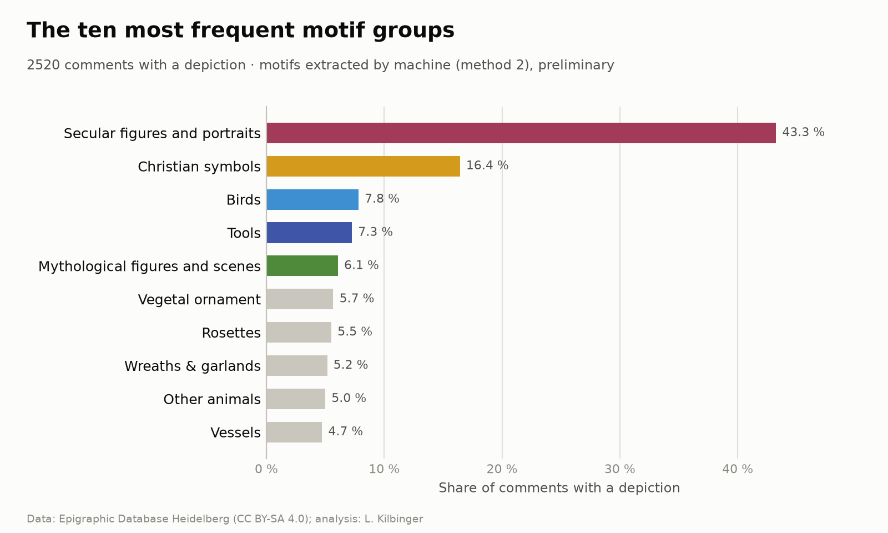
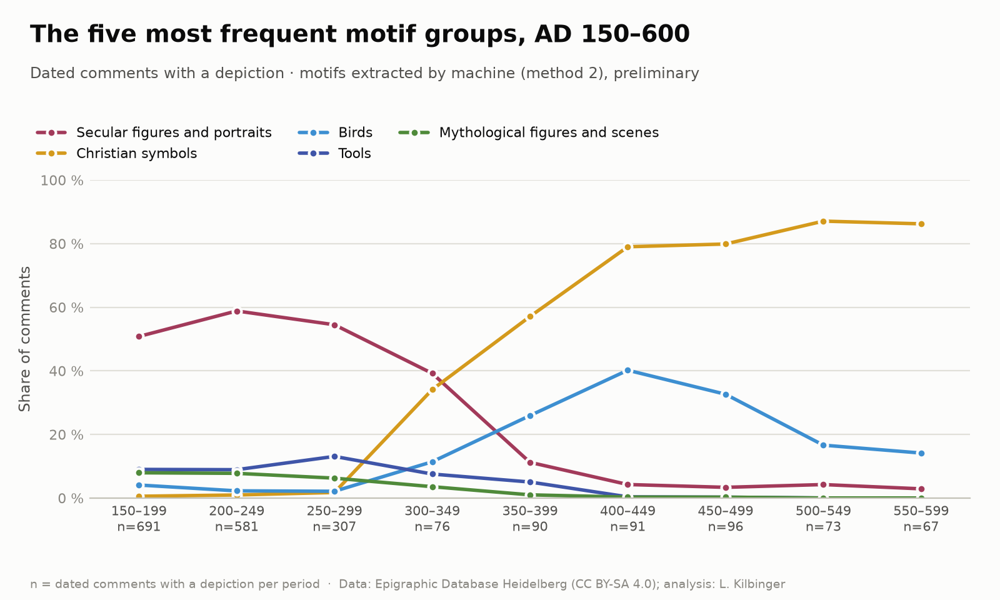

# edh-motif-extraction

**NLP-Assisted Indexing of Metadata in Epigraphic Databases**

*Figurative Representations on Late Antique Funerary Inscriptions: Iconographic
Vocabulary, Gold Standard and Method Comparison on the EDH Dataset*

Lisa Kilbinger, Philipps-Universität Marburg. Version 1.0, September 2026.
DOI: [DOI]

*[Deutsche Fassung](README.md)*

## Context

Figurative representations on late antique funerary inscriptions are important
evidence of an emerging Christian iconography, but have not yet been analysed
on a large scale. Epigraphic databases record them only in unstructured and
inconsistent form: as free text in the commentary field or as an editorial
note within the transcription. This recording practice prevents systematic
analysis of these motifs.

This data publication was produced within the [HERMES research study
programme][hermes]. It comparatively evaluates automated methods for
converting iconographic information into structured data: from rule-based
dictionary matching through linguistic analysis to a fine-tuned language
model. The comparison draws on a purpose-built iconographic vocabulary and a
manually annotated gold standard. The results reveal the strengths and
limitations of each approach, laying the groundwork for a comprehensive
analysis of early Christian imagery on inscription carriers.

## Contents

For this purpose, this repository contains:

- a multilingual **iconographic vocabulary**: 374 image elements in a
  category tree, search terms in German, Latin and English, 354 motif
  rules; linked to Iconclass (297 of 374) and aligned with the EAGLE
  vocabulary "Decoration";
- a **gold standard** of 1,100 randomly drawn, manually annotated EDH
  commentaries (800 development, 300 test) with a concordance to
  Trismegistos (1,042) and EDCS (947);
- **four methods** for automatic motif detection (dictionary matching,
  lemmatisation, dependency parsing, BERT) and the **method comparison** on
  the 300 test commentaries, with complete code to reproduce all values.

## Data basis

The data basis is the commentary field of the Epigraphic Database Heidelberg
(EDH). The EDH is one of the most established digital resources for Latin
epigraphy. It follows the FAIR principles and provides its data under
CC BY-SA 4.0. There is no dedicated field for figurative representations.
Mentions of image motifs appear only as free text in the commentary field,
together with remarks on the state of preservation, the interpretation of
the text and similar matters.

**Query and scope.** The data were retrieved on 6 May 2026 via the public
application programming interface (API) of the EDH:

- 22,837 funerary inscriptions (inscription type "titulus sepulcralis")
  whose dating falls within or touches the period AD 150–800
- of these, with a commentary: 12,676 (`data/corpus/edh_comments.json`)
- of these, dated later than AD 150 or undated (time filter of the
  methods): 11,458

**Cleaning.** In the API response, start and end dates are partly swapped;
they are corrected during retrieval. For publication, the data are reduced
to EDH number, commentary and dating; the links to Trismegistos and EDCS
are included only for the 1,100 annotated commentaries.

**Data critique.** Whether and in how much detail representations are
mentioned in the commentary depends on the individual editor; the information
is therefore inconsistent and mostly follows no standard.

## Authority data and controlled vocabularies

Where a match exists, the image elements are linked to Iconclass (297 of 374)
and aligned with the EAGLE vocabulary "Decoration" (Europeana Network of
Ancient Greek and Latin Epigraphy). This vocabulary was developed in the EAGLE
Europeana Project (2013–2015) and is also used by the EDH. However, it
comprises only a few terms; for the majority of representations, no standard
vocabulary exists. The inscriptions are linked via their EDH number to
Trismegistos (1,042 of 1,100) and EDCS (947 of 1,100).

## Data and files

All data as JSON or CSV (UTF-8).

```
data/
  corpus/
    edh_comments.json         EDH commentary texts (retrieved 6 May 2026)
  gazetteer/                  vocabulary
    rules/                       motif rules and variants
    filters/                     signal_words, stoplist, false_friends, compound_exceptions
    categories.json           category tree
    element_synonyms.json     synonyms, multilingual (de, la, en)
    elements.json             vocabulary list
  goldstandard/               manually annotated commentaries, guidelines, concordance
  method_comparison/          published measurement on the test data
    predictions/                 method outputs: m1_dictionary.json … m4_bert_seed44.json
    bootstrap.json               statistical uncertainty of the results
    scores.csv, differences.csv  result tables
    m4_bert_runs.json            checksums and training time of the BERT runs
src/
  paths.py                     all file paths and file names
  corpus/                      retrieval from the EDH and corpus building
  common/                      shared by all methods (matching.py, motifs.py)
  methods/                     the four methods
  evaluation/                  measurement and evaluation
  analysis/                    first analysis (figures)
figures/                       figures illustrating a first analysis
results/                       results of your own runs (not versioned, generated)
  corpus/                        your own retrieval from the EDH and the corpus built from it
  full_corpus/                   methods 1–3 on all commentaries
  method_comparison/             your own measurement, structured like data/method_comparison/
  bert/                          silver standard and models of method 4
```

**Gold standard** (`data/goldstandard/`): The 1,100 annotated commentaries
were drawn in three samples from the same random sequence (fixed seed) and
do not overlap.

| File | Contents |
|---|---|
| `edh_devsample.json` | 500 commentaries. Development data: vocabulary, rules and methods were developed on them |
| `edh_former_testsample.json` | 300 commentaries, originally drawn as test data; annotation revealed gaps in the vocabulary, which were filled. Since then counted as development data and used for error analysis |
| `edh_testsample.json` | 300 commentaries (70 with a representation). The actual test data: drawn only after method development was completed, used exclusively for the final measurement |
| `edh_devsample_word_markings.json` | word-level markings of the development commentaries (training data for method 4) |
| `annotation_guidelines_de.md` | annotation guidelines (German) |
| `inscription_identifiers.csv` | concordance EDH – Trismegistos – EDCS |

The test data were annotated according to the same guidelines as the
development data (`annotation_guidelines_de.md`), without knowledge of the
method results. Image elements and motifs are annotated; variants, counts
and uncertainty markers are also annotated, but are not detected by any
method and not evaluated.

## Data fields

**Corpus** (`edh_comments.json`): per inscription `id` (EDH number),
`commentary`, `not_before` and `not_after` (dating in years as text,
negative = BC; `null` = undated).

**Vocabulary** (`gazetteer/`). All files are linked by English keys
(`dove`, `bird_with_branch`).

| File | Fields |
|---|---|
| `elements.json` | per element `label`, `iconclass_notation` (`null` if no match), `category` (category when the element forms a motif on its own); rarely `group` (`person`: persons merged in the lenient evaluation) and `attribute` (`true`: object a figure holds or wears) |
| `element_synonyms.json` | per element search terms `de`, `la`, `en`; the methods search `de` only |
| `categories.json` | tree: per category `label`, `iconclass_notation`, `children` |
| `rules/motif_rules.json` | rules with `id`, `category` and `requires` (list with `element`, `min_count`, optional `max_count`, `take_all`: take all remaining instances, `shared`: check, do not consume). The first rule met wins; remaining elements become single motifs |
| `rules/variant_conditions.json`, `…_synonyms.json` | variants (`label`) and their search terms; for annotation only, not used by any method |
| `filters/signal_words.json` | words that alone indicate a representation ("Relief") |
| `filters/stoplist.json` | `element` not searched as a single word, with `reason`; optional `methods` (only these methods) and `requires_context` (method 3 keeps it with one of these words in the same clause) |
| `filters/false_friends.json` | `word` that contains a search term by chance ("Fassade"), with `reason` |
| `filters/compound_exceptions.json` | `no_modifier`: compounds whose first part is not depicted ("Schafschere"); `modifier_replaces_head`: `modifier` replaces the elements in `heads` |

**Gold standard** (`edh_devsample.json`, `edh_former_testsample.json`,
`edh_testsample.json`), one entry per EDH number:

| Field | Contents |
|---|---|
| `has_depiction` | `true` if the commentary mentions a representation |
| `evidence` | supporting passage (only with a representation) |
| `elements` | one entry per element type with `element` (key from `elements.json`), `count` (number, or `">1"` for a plural without a number), `variant_condition` (`null`, one or several variants from `variant_conditions.json`) and `uncertain` (`true` if the commentary marks the interpretation as uncertain) |
| `motifs` | motifs with `elements` (element keys) and `category` (key from `categories.json`); only with a representation |

`edh_devsample_word_markings.json`: per EDH number `sentences` with `tokens`
(words) and `labels` (per word a list of element keys, mostly empty).
`inscription_identifiers.csv`: `edh_id`, `subset` (sample), `edh_url`,
`trismegistos_uri`, `edcs_uri` (empty if there is no link).

**Method comparison** (`method_comparison/`). All values as proportions
between 0 and 1.

| File | Fields |
|---|---|
| `predictions/*.json` | as the gold standard, without `evidence`; in addition `matched_text` (matched passage, missing for derived elements). `uncertain` is always `false`, `variant_condition` holds portrait forms only (`bust`, `full_figure` …) |
| `scores.csv` | per method `method`, `name`, `description`, `training_runs` (BERT only); per level (`depiction_f1`, `elements_micro_f1`, `elements_macro_f1`, `motifs_f1`) the value, `_low` and `_high` (95 % interval) and `_sd_runs` (standard deviation across the BERT runs); plus `depiction_precision`, `depiction_recall` |
| `differences.csv` | per comparison (`comparison`, e.g. "method 2 minus method 3") the difference, `_low` and `_high` per level |
| `bootstrap.json` | basis of both tables: `n_comments`, `n_with_depiction`, `n_samples` (bootstrap samples), `seed`, `bert_runs`; `methods` and `differences` with `value`, `low`, `high` per level; `bert_across_runs` with `mean`, `sd` and `runs` per level |
| `m4_bert_runs.json` | per run `seed`, `model_sha256`, `silver_sha256` (checksums of model and silver standard), `training_minutes` (`null`: not recorded) |

## Scripts

| Script | Function |
|---|---|
| `corpus/fetch_edh.py` | retrieves the funerary inscriptions (AD 150–800) via the EDH API and corrects swapped dates |
| `corpus/build_corpus.py` | builds the corpus: EDH number, commentary and dating of each inscription with a commentary |
| `methods/m1_dictionary.py` | Method 1: dictionary matching |
| `methods/m2_nlp_lemma.py` | Method 2: lemmatisation (Stanza) |
| `methods/m3_dependency_chunked.py` | Method 3: dependency parsing (Stanza), in chunks; same result as `m3_dependency.py`, less memory |
| `methods/m4_bert.py` | Method 4: BERT (deepset/gbert-base); `silver`, `train`, `predict`, `runs` |
| `evaluation/measure_testsample.py` | applies all four methods to the 300 test commentaries → `predictions/` |
| `evaluation/evaluate.py` | precision, recall and F1 of one method against development or test data |
| `evaluation/bootstrap.py` | 95 % intervals of the values and of the differences between methods → `bootstrap.json` |
| `evaluation/comparison_tables.py` | result tables `scores.csv`, `differences.csv` from `bootstrap.json` |
| `analysis/motif_groups.py` | figures in `figures/` |

All scripts are in `src/`. `evaluate.py` and `comparison_tables.py` read
either your own run (`results/method_comparison/`) or, with `--published`, the
published measurement (`data/method_comparison/`).

## Results at a glance

F1 in % on the 300 test commentaries (70 with a representation); method 4
as the mean of three training runs. 95 % intervals and paired differences:
`data/method_comparison/scores.csv` and `differences.csv`.

| | 1 Dictionary | 2 Lemmatisation | 3 Dependency parsing | 4 BERT |
|---|:---:|:---:|:---:|:---:|
| Representation | 97.2 | 98.6 | 98.6 | 96.1 |
| Elements, micro | 84.6 | 91.8 | 92.5 | 83.3 |
| Elements, macro | 73.1 | 77.8 | 80.8 | 64.2 |
| Motifs | 52.7 | 73.9 | 73.5 | 66.7 |

Methods 2 and 3 are level in the lead and outperform method 4 on elements and
motifs; the 95 % intervals of these differences lie entirely above zero. All
four methods detect about equally well whether a representation is present.
Where little manual annotation is available, a carefully constructed
rule-based approach is therefore preferable to a fine-tuned language model.

Methodology, error analysis and discussion will be published in detail in
the HERMES research report (DOI to follow).

## Limitations

- **Small test data:** As only 70 test commentaries contain a representation,
  the intervals are wide (motifs about ±9 points). Differences below about 5
  points cannot be demonstrated.
- **Macro intervals:** The macro average rests on many element types with only
  one or two occurrences. Many bootstrap samples lack such rare types
  entirely, and with them their mostly poor scores. The intervals therefore
  lie mostly above the point value (e.g. method 4: 64.2 [58.0–77.1]). They are
  only a rough guide.
- **Method 4:** three runs, settings not tuned; the silver standard carries
  over the gaps of methods 2 and 3.

## Example: first analysis

A preliminary analysis of all EDH commentaries with method 2 is documented in
`figures/` (`src/analysis/motif_groups.py`). The values come from a separate
run over all commentaries and are not part of the published measurement. Motif
groups are the subcategories of the category tree. Among the 2,520
commentaries with a representation, secular figures and portraits (43 %) and
Christian symbols (16 %) predominate.



*The ten most frequent motif groups among the 2,520 commentaries with a
representation (method 2, preliminary).*

Over time (each commentary spread evenly across its dating range), secular
figures and portraits decline from about AD 300, while the share of
Christian symbols rises to over 80 % by the 6th century. From AD 300
onwards, each period covers only 67–96 commentaries.



*The five most frequent motif groups over time, AD 150–600 (method 2,
preliminary).*

## Installation and reproduction

Python 3.11 or newer.

```
pip install -r requirements.txt
python -c "import stanza; stanza.download('de')"

# without your own run: check the published measurement
python src/evaluation/comparison_tables.py --published   # tables
python src/evaluation/evaluate.py m2_nlp_lemma --published  # one method against the test data

# optional: retrieve the corpus again from the EDH (a few minutes)
python src/corpus/fetch_edh.py                     # -> results/corpus/edh_titsep_150_800.json
python src/corpus/build_corpus.py                  # -> results/corpus/edh_comments.json

# your own run
python src/methods/m1_dictionary.py                # method 1 (seconds)
python src/methods/m2_nlp_lemma.py                 # method 2 (approx. 30 min, CPU)
python src/methods/m3_dependency_chunked.py all    # method 3 (approx. 60 min)
python src/methods/m4_bert.py silver               # method 4: silver standard from 2 and 3
python src/methods/m4_bert.py train                # method 4: training, seed 42 (approx. 40 min)
python src/evaluation/measure_testsample.py        # all methods on the test data
python src/methods/m4_bert.py runs                 # method 4, seeds 43 and 44 (approx. 85 min)
python src/evaluation/bootstrap.py                 # intervals and paired differences
python src/evaluation/comparison_tables.py         # tables
python src/evaluation/evaluate.py m2_nlp_lemma --test  # one method against the test data
python src/analysis/motif_groups.py                # figures (requires method 2)
```

The EDH changes continuously; a new retrieval therefore yields slightly
different data than the published corpus in `data/corpus/`, on which all
reported values are based. A newly built corpus does not replace it. The EDCS
links in the concordance were additionally taken from the EDH detail pages;
this step is not included.

Methods for `evaluate.py`: `m1_dictionary`, `m2_nlp_lemma`, `m3_dependency`, `m4_bert`.
The silver standard requires the complete results of methods 2 and 3;
`bootstrap.py` requires the outputs of `measure_testsample.py` and
`m4_bert.py runs`. Small deviations are possible when recalculating:
Stanza's dependency parsing is not deterministic in every case (method 3),
and BERT training on different hardware does not yield bit-identical
weights.

## Reuse

- Data under CC BY-SA 4.0 (compatible with the EDH licence), code under MIT.
- Vocabulary and gold standard can be used independently of the code, for
  example to test your own methods against `edh_testsample.json`.
- The workflow can be transferred to other epigraphic and (art-)historical
  databases.

## Versions

Version 1.0, September 2026. Each version receives its own DOI via Zenodo.

## Citation

Kilbinger, Lisa (2026): NLP-gestützte Erschließung von Metadaten in
epigraphischen Datenbanken. Figürliche Darstellungen auf spätantiken
Grabinschriften: Ikonographisches Vokabular, Goldstandard und
Methodenvergleich am Datensatz der EDH. Version 1.0. Zenodo. [DOI]
(machine-readable: `CITATION.cff`)

## Sources

- Commentary texts, EDH numbers, datings, Trismegistos and EDCS links:
  Epigraphic Database Heidelberg, https://edh.ub.uni-heidelberg.de/
  (CC BY-SA 4.0).
- Latin search terms based on the image descriptions of the Epigraphic
  Database Bari (EDB), https://www.edb.uniba.it/.
- Authority data: Iconclass (https://iconclass.org/), EAGLE vocabulary
  "Decoration" (https://www.eagle-network.eu/voc/decor.html).
- Vocabulary, annotations, methods and analysis: Lisa Kilbinger.

## Licence

- Data (`data/`) and documentation: CC BY-SA 4.0, in accordance with the
  EDH licence
- Code (`src/`): MIT

[hermes]: https://www.hermes-hub.de/formate/forschungsstudien/
